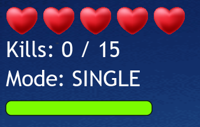

# Final Flight
Final Flight is a 2D arcade-style aerial combat game where the player controls a fighter plane to defeat enemy planes and progress through three increasingly challenging levels. The gameplay focuses on movement, shooting, and managing different weapon modes, while avoiding enemy fire and maintaining health.

--- 

## How to Play

### Movement
- **W**: Move up
- **S**: Move down
- **A**: Move left
- **D**: Move right
- **Shift**: Hold to activate speed boost while moving

### Firing
- **Spacebar (Tap)**: Fire a single shot
- **Spacebar (Hold)**: Fire continuously

### Weapon Modes
- **1**: Equip single-shot firing mode
- **2**: Equip spread firing mode
- **3**: Equip heavy firing mode

### Pause and Resume
- **Esc**: Pause the game
- **Esc (while paused)**: Resume the game

### HUD

- **Hearts**: Show player health remaining
- **"Kills" Counter**: Tracks player kill count and displays kills needed to progress to the next level
- **"Mode" Indicator**: Displays the currently equipped firing mode
- **Speed Boost Bar**: Shows remaining energy for speed boost

---

## GitHub Repository
[GitHub Repository Link](https://github.com/aarngkk/CW2024)

---

## Compilation Instructions

### Prerequisites
- **Java Version**: This project was developed and tested using **Java 19**.
- **IDE**: IntelliJ IDEA (any edition) or Eclipse (any version).
- **Build Tool**: Maven is used for dependency management and building the project.

### Steps to Compile and Run in IntelliJ IDEA
1. **Open the Project in IntelliJ IDEA**
    - Launch IntelliJ IDEA.
    - Select `File > Open` and navigate to the root directory of the extracted project folder (the folder containing the `pom.xml` file).

2. **Import the Maven Project**
    - IntelliJ will detect the `pom.xml` file and prompt you to import it as a Maven project. Click `Yes`.
    - Wait for IntelliJ to resolve all dependencies.

3. **Build the Project**
    - Open the Maven tool window (`View > Tool Windows > Maven`).
    - Expand the `Lifecycle` section.
    - Double-click `clean` to remove previous build artifacts.
    - Double-click `package` to compile the code and package the application into a JAR file. The JAR file will be located in the `target` directory.

4. **Run the Application**
    - Navigate to the `src/main/java/com/finalflight/game/main` directory.
    - Open the `Main` class containing the `main` method (entry point).
    - Right-click the file and select `Run Main` or click the green play button next to the `main` method.

### Steps to Compile and Run in Eclipse
1. **Open the Project in Eclipse**
    - Launch Eclipse.
    - Select `File > Import`.
    - In the import wizard, choose `Existing Maven Projects` under `Maven` and click `Next`.
    - Browse to the root directory of the extracted project folder (the folder containing the `pom.xml` file) and select `Finish`.

2. **Build the Project**
    - Right-click the project in the `Project Explorer` and select `Run As > Maven build`.
    - In the dialog, set the goal to `clean package` and click `Run`. This will compile the code and package it into a JAR file located in the `target` directory.

3. **Run the Application**
    - Navigate to the `src/main/java/com/finalflight/game/main` directory in the `Project Explorer`.
    - Right-click the `Main.java` file and select `Run As > Java Application`. The application will run with the `main` method as the entry point.
   
---

## Features Implemented and Working Properly

### 1. Horizontal Movement and Alternate Controls
- Implemented player left and right movement, allowing the player to move freely around the level.
- Added alternative WASD key controls for movement: 'W/S' for up and down movement and 'A/D' for left and right movement.

### 2. Multiple Firing Modes
- Added spread and heavy firing modes for the player.
- Spread firing mode fires three projectiles in a spread pattern with a slightly lower fire rate.
- Heavy firing mode fires a large, high-damage projectile downwards and forwards with a much lower fire rate.
- To switch between firing modes: '1' key for single (default firing mode), '2' key for spread, and '3' key for heavy.

### 3. Player Speed Boost
- Player activates speed boost by holding the 'Shift' key.
- Speed boost bar indicates the remaining speed boost available.
- Depletes when used and recharges after a short delay when not in use.

### 4. Persistent Player Health
- Player health carries over between levels.

### 5. Kill Counter and Boss Health Bar
- Kill counter tracks player kill progress.
- Boss health bar shows boss health for better gameplay visibility.

### 6. Advanced Enemy Plane
- New enemy type that has increased movement speed, health, and firing rate compared to regular enemy planes.
- Has a distinct design to be distinguishable from regular enemy planes.

### 7. Added Extra Level
- Added level two between the first level and the final boss level.
- Level two introduces advanced enemy planes as a new enemy type.
- Final boss level is now LevelThree.

### 8. Boss Level Enhancements
- Regular and advanced enemy planes spawn alongside the boss in level three.
- Boss activates invulnerability shield at 50% and 20% health.
- Boss has increased movement speed and fire rate when health is 20% or below.
- Enemy spawn chance and total number of enemies are increased when the boss's health drops to 50%, and increased even more at 20%.

### 9. Music and Sound Effects
- Added background music for main menu and levels.
- Added sound effects for player and enemy actions such as firing, taking damage, speed boost, and weapon equips.
- Added sound effects for boss shield activation and boss explosion.
- Added game over and game win music that plays when the player loses or wins the game.

### 10. Visual Effects
- All planes (player, enemies, and boss) flash upon receiving damage.
- User plane tilts slightly to indicate when speed boost is active.
- Shield image displays and moves with the boss when boss shield is active.
- Boss displays explosion effect when defeated.

### 11. Main Menu
- Main menu interface displays the game title, start game button to initiate gameplay, and a quit button to close the application.

### 12. Pause Menu
- Pause button and ESC key functionality to allow users to pause and unpause the game.
- Pausing the game darkens/blurs the background and fades the background music out.
- Has a "Resume" button to unpause game, "Restart Game" button to start game back at level one, "Quit Game" button to exit game.

### 13. Game Over Screen
- Displays when the player reaches 0 health and dims/blurs the game background.
- Has a "Restart" button to restart game from level one, and a "Quit Game" button to exit the game.

### 14. Victory Screen
- Displays when the player defeats the boss in level three.
- Has a "Restart Game" button to restart game from level one, and a "Quit Game" button to exit the game.

### 15. Game Icon and High-Resolution Image Assets
- Added an icon image for the game.
- Replaced existing game assets with higher-definition images.
- Replaced level backgrounds with GIFs to improve game aesthetics.

---

## Features Implemented but Not Working Properly

### None
- *All features implemented are functioning as intended.*

---

## Features Not Implemented

### 1. Environmental Obstacles in Levels
- **Reason**: Adding obstacles into game levels required additional scripting for enemy behaviour and collision detection, and was deemed non-essential due to time constraints and prioritization of core mechanics. 

### 2. Limited Player Ammunition
- **Reason**: An ammunition system to balance gameplay would require significant changes to the weapon mechanics, and the HUD display. Game balance could instead be maintained simply by modifying weapon fire rates.

### 3. Player Loadout (Select Firing Mode & Special Ability)
- **Reason**: Designing a loadout system would require implementing an additional menu, player choices, and additional game states. Special abilities would also require additional visual effects, cooldown timers, and balancing to ensure fair gameplay.

### 4. Player Invulnerability after Receiving Damage
- **Reason**: While invulnerability frames improve player fairness and reduce frustration, implementing this mechanic required adding timers and modifying the collision system. Due to time limitations, efforts were focused on ensuring accurate collision detection and enemy interactions.

### 5. More Firing Modes
- **Reason**: Expanding the firing modes would require additional game balancing and significant work on projectile behaviours, visual effects, and HUD integration. Introducing additional firing modes could also complicate gameplay and overwhelm the player.

---

## New Java Classes
### 1. MusicPlayer
- **Purpose**: The `MusicPlayer` class is a singleton class responsible for managing music playback in the game. It handles playing, pausing, resuming, and fading music in and out. This class ensures that only one instance of the `MusicPlayer` is created at a time.
- **Location**: [src/main/java/com/finalflight/game/audio/MusicPlayer.java](src/main/java/com/finalflight/game/audio/MusicPlayer.java)

### 2. SoundEffectPlayer
- **Purpose**: The `SoundEffectPlayer` class is responsible for playing sound effects in the game. It uses JavaFX's `AudioClip` to handle audio playback. This class provides methods to play, stop, adjust volume, and loop sound effects.
- **Location**: [src/main/java/com/finalflight/game/audio/SoundEffectPlayer.java](src/main/java/com/finalflight/game/audio/SoundEffectPlayer.java)

### 3. MainMenuController
- **Purpose**: The `MainMenuController` class is responsible for managing the main menu of the game. It initializes the game controller, handles main menu actions such as starting the game, and manages background music playback for the main menu.
- **Location**: [src/main/java/com/finalflight/game/controller/MainMenuController.java](src/main/java/com/finalflight/game/controller/MainMenuController.java)

### 4. AdvancedEnemyPlane
- **Purpose**: The `AdvancedEnemyPlane` class represents a more challenging enemy plane in the game. It extends `FighterPlane` and introduces faster movement, higher health, and a higher firing rate compared to a regular enemy plane.
- **Location**: [src/main/java/com/finalflight/game/gameobjects/AdvancedEnemyPlane.java](src/main/java/com/finalflight/game/gameobjects/AdvancedEnemyPlane.java)

### 5. SpreadShotProjectile
- **Purpose**: The `SpreadShotProjectile` class represents a projectile with a spread effect, moving in a specified direction and destroyed once it exceeds its range. This class extends `AbstractProjectile` and adds functionality for range-based destruction and directional movement based on initial velocity values.
- **Location**: [src/main/java/com/finalflight/game/gameobjects/SpreadShotProjectile.java](src/main/java/com/finalflight/game/gameobjects/SpreadShotProjectile.java)

### 6. HeavyShotProjectile
- **Purpose**: The `HeavyShotProjectile` class represents a high-damage projectile with limited health. It extends `AbstractProjectile` and introduces functionality for decrementing health upon damage and movement in both horizontal and vertical directions.
- **Location**: [src/main/java/com/finalflight/game/gameobjects/HeavyShotProjectile.java](src/main/java/com/finalflight/game/gameobjects/HeavyShotProjectile.java)

### 7. LevelTwo (original LevelTwo is renamed to LevelThree)
- **Purpose**: The `LevelTwo` class represents the second level of the game. It extends the `BaseLevel` class and defines the behaviour and characteristics specific to Level Two, including spawning regular and advanced enemies, background image, and progression conditions.
- **Location**: [src/main/java/com/finalflight/game/level/LevelTwo.java](src/main/java/com/finalflight/game/level/LevelTwo.java)

### 8. BossExplosionEffect
- **Purpose**: The `BossExplosionEffect` class represents the visual and audio effects of a boss explosion in the game. It extends `ImageView` to display a GIF animation of the explosion and plays a sound effect when triggered.
- **Location**: [src/main/java/com/finalflight/game/visual/BossExplosionEffect.java](src/main/java/com/finalflight/game/visual/BossExplosionEffect.java)

### 9. Test Classes
- **Purpose**: Test classes ensure the core mechanics and features of the game function correctly and consistently. They verify that gameplay elements, such as player movement, shooting mechanics, enemy behaviors, and collisions, perform as intended. 
- **Location**: [src/test/java/com/finalflight/game](src/test/java/com/finalflight/game)

---

## Renamed Classes

#### 1. Controller → `GameController`

#### 2. ActiveActor → `GameObject`

#### 3. ActiveActorDestructible → `DestructibleGameObject`

#### 4. Boss → `BossPlane`

#### 5. LevelParent → `BaseLevel`

#### 6. LevelTwo → `LevelThree`

#### 7. LevelView → `BaseLevelView`

#### 8. LevelViewLevelTwo → `LevelThreeView`

#### 9. Projectile → `AbstractProjectile`

#### 10. UserProjectile → `SingleShotProjectile`

---

## Modified Java Classes

### 1. BaseLevel
- **Change**: Called `timeline.stop();` in the `goToNextLevel` method.
   - **Reason**: Ensure the timeline is properly stopped, fixing an issue that caused the game to crash when transitioning from Level 1 to Level 2

### 2. ShieldImage
- **Change**: Edited shield image path to use .png file instead of .jpg file.
    - **Reason**: Shield image resource is a .png file.

### 3. Main
- **Change**: Changed game `TITLE` to "Final Flight".
    - **Reason**: "Final Flight" is a more appealing name that gives the game a distinct identity.

- **Change**: Modified `start` method to load the main menu interface instead of directly launching the game.
   - **Reason**: Improve game navigation for the player.

### 4. BossPlane
- **Change**:  Removed random probability aspect in `shieldShouldBeActivated` and modified boss shield to activate when boss health reaches 50% and 20%.
   - **Reason**: Improve gameplay balance and predictability.

### 5. GameOverImage and WinImage
- **Change**:  Deleted `GameOverImage` and `WinImage` classes and added game over and win screens in the `BaseLevelView` class instead.
    - **Reason**: Reduce redundancy and simplify code structure by integrating visual components into `BaseLevelView` class.

### 6. EnemyPlane
- **Change**: Modified `INITIAL_HEALTH`  constant to 3 instead of 1.
    - **Reason**: Improve gameplay balance and encourage more strategic gameplay.

### 7. LevelOne
- **Change**: Significantly reduced `ENEMY_SPAWN_PROBABILITY` from 0.20 to 0.015.
    - **Reason**: Enhance gameplay pacing as `ENEMY_SPAWN_PROBABILITY` of 0.20 (20% chance each frame) causes enemies to be able to spawn in nearly every frame.

---

## Unexpected Problems
### 1. **Game Crash**
- **Challenge**: Initial version of the game crashed every time when transitioning from level one to level two.
- **Resolution**: Examined code related to level transition to identify the issue and added method call `timeline.stop();` in the `goToNextLevel` method in `BaseLevel` to ensure the timeline is properly stopped before transitioning to the next level.

### 2. Boss Shield Image Implementation
- **Challenge**: Boss shield mechanic functions but initially provided no visual indication to the player when it is active.
- **Resolution**: Implemented `ShieldImage` initialisation and update methods in the `LevelThreeView` class and used them in the `LevelThree` class to display the shield image.

### 3. Player Horizontal Movement Implementation
- **Challenge**: The first implementation introduced a delay to players when switching movement directions.
- **Resolution**: Updated the `stop` method in `LevelParent` to prioritise active keys being pressed, therefore ensuring the user plane moves instantly in the direction of the latest movement key pressed with no delay.
